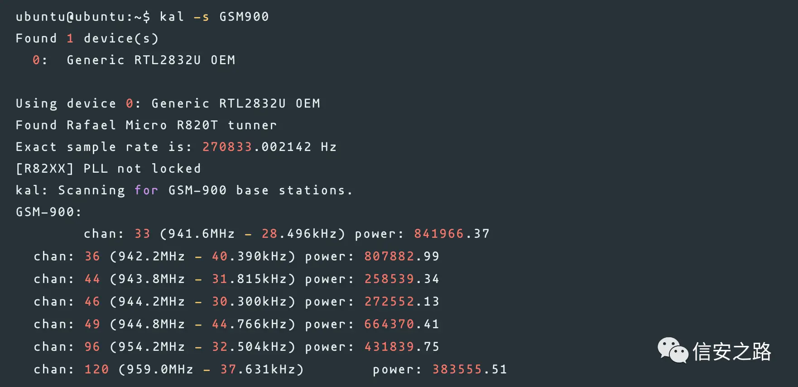
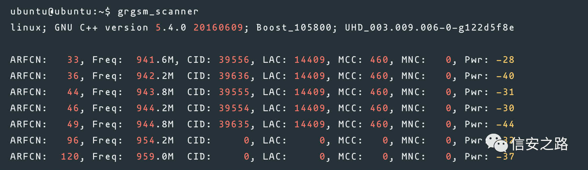
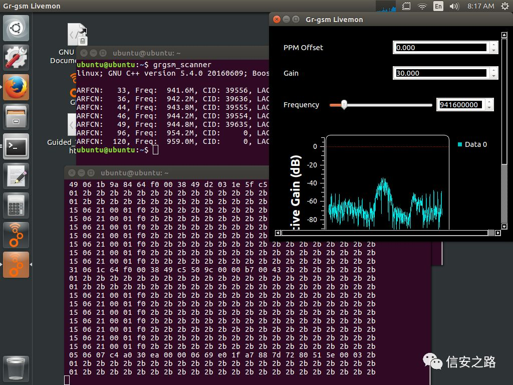
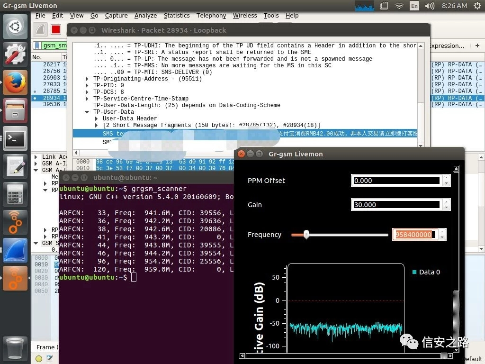
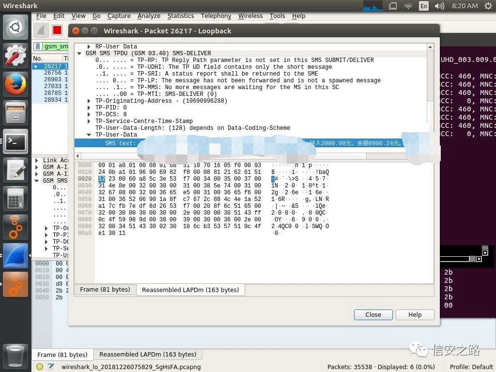
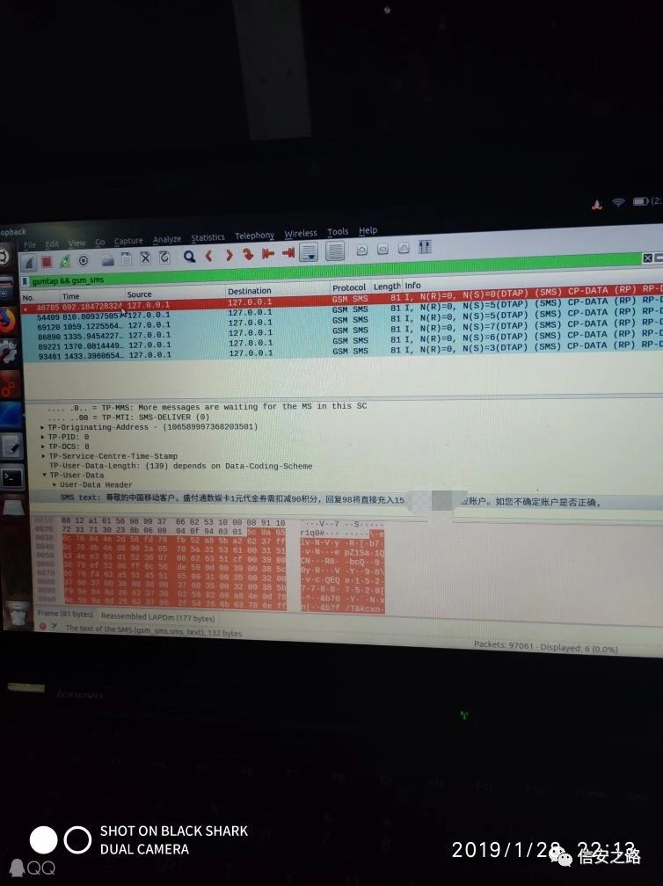
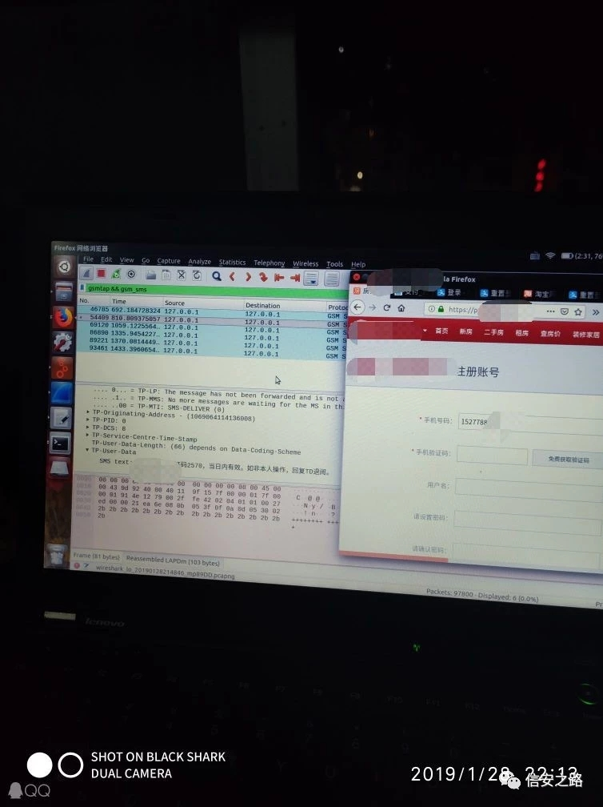
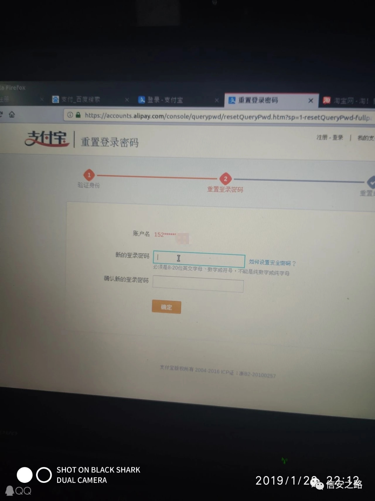

# 浅谈 GSM 网络的安全性 实战截取用户身份信息

<!--more-->

本文首发于信安之路微信公众号  
文章链接:  
https://mp.weixin.qq.com/s/ndsPZk2dZ-8p9PhUhp45pg  
作者: 记忆里的纯真

最近查找资料的时候发现了前段时间被爆出来的利用 GSM 劫持+短信嗅探的方式来盗刷银行卡的案例，想起来一直想写一篇关于 GSM 的文章，故写此文来浅谈一下 GSM 网络的安全性。


注意: 此文涉及的内容具有一定的风险性，只可用作技术研究。切勿用于非法目的！！！

注意: 此文涉及的内容具有一定的风险性，只可用作技术研究。切勿用于非法目的！！！

注意: 此文涉及的内容具有一定的风险性，只可用作技术研究。切勿用于非法目的！！！

## 原理剖析
#### GSM 通信基本原理

GSM 分配的频段主要有两个频段，分别是 GSM900 和 GSM1800，其中 GSM900 的上行频段是 890-915MHz，下行频段是 935-960MHz。GSM1800 的上行频段是 1710-1785MHz，它的下行频段是 1805-1880MHz。GSM900 占带宽 25M，GSM1800 占带宽 75M。由载频带宽 200KHz，所以 GSM900 上下频点各是 25x5-1 一共 124 个，GSM1800 的上下频点各是 75x5-1 一共 374 个。

关于为什么会出现这个问题？

这就要从 GSM 网络说起了

我们马上都要进入 5G 时代了，但是现在还有大量的 2G 的 GSM 网络存在，现在的 GSM 网络主要是中国移动的用户，中国电信没有 GSM 的网络，中国联通正在清退 GSM 网络。

GSM 网络有个很致命的缺点就是有很多伪基站，手机在打电话或者发短信的时候，手机是先连到离你最近的基站 (BTS) 然后在进入 RNC, MSC 进行核心网络的交换，在发给离对方最近的基站在传送到对方的手机，如果这个时候你手机进入的不是运营商的基站而且伪基站那就麻烦了。

#### 为什么我们手机会进入假基站？

这是因为 GSM 网络的鉴权存在的缺陷运营商是验证你手机是否合法用户，而手机是不会验证接入基站是否是合法的基站，这样进入了伪基站我们也是不知道的，如今的 3G,4G 验证会比 GSM 要安全很多。

### GSM 攻击手法
目前国内 GSM 攻击手法就两种：一种是主动 GSM 攻击另一种是被动 GSM 攻击

#### 主动攻击：
攻击者伪装成基站（BTS），然后发射诱导信号，引导被攻击者链接到非法基站，由于 GSM 属于单向鉴权，所以移动台只能被基站鉴权，而无法对基站进行鉴权，因此用户很容易被诱导至伪基站进行数据通信。当被攻击者进行数据交换，比如拨打电话或者发送短信时，攻击者通过伪造的基站对其发送的数据进行劫持丶篡改或监听以达到攻击目的。

#### 被动攻击：
即攻击者不会主动向被攻击者终端发送诱导信号，而是监听基站与移动台之间传播的广播信号，并且对信号进行解密以达到侦听的目的。

#### 二者的区别：
就是一个可以监听数据还可以动态修改往来的数据，而另一个只能被动监听数据而无法直接篡改，而本文实验过程是后者被动监听。

### GSM 加密算法
GSM 使用了很多算法，但是其中主要使用的就三种加密算法：A3 鉴权算法，A8 是密钥的约定算法，A5 是用于加密的流密码。（具体算法描述和简介作者推荐大家去看《无线电安全攻防大揭秘》）

## 攻击复现

### 环境搭建
**OS**: `Ubuntu 16.04` or `Kali Linux 2019.1`

Hardware: 电视棒 RTL-SDR、 HackRF 、 BladeRF、 LimeSDR、 USRP 任选其一均可

PS: 关于 GSM Sniff 有两种方案 (C118+Osmocombb 和 SDR+gr-gsm) 这里只讨论后者。

#### Ubuntu
##### 安装编译依赖包
```bash
$ sudo apt update && \
sudo install git cmake g++ python-dev python-pip \
swig pkg-config libfftw3-dev libboost-all-dev \
libcppunit-dev libgsl-dev libusb-dev libsdl1.2-dev \
python-wxgtk3.0 python-numpy python-cheetah python-lxml \
doxygen libxi-dev python-sip libqt4-opengl-dev \
libqwt-dev libfontconfig1-dev libxrender-dev \
python-sip python-sip-dev python-qt4 python-sphinx \
libusb-1.0-0-dev libcomedi-dev libzmq3-dev python-mako python-gtk2
```

##### 使用PyBOMBS构建
```bash
$ sudo pip install --upgrade pip
$ sudo pip install git+https://github.com/gnuradio/pybombs.git
$ sudo pybombs recipes add gr-recipes git+https://github.com/gnuradio/gr-recipes.git
$ sudo pybombs recipes add gr-etcetera git+https://github.com/gnuradio/gr-etcetera.git
$ sudo pybombs prefix init /usr/local -a myprefix -R gnuradio-default
```
此过程耗时较长，请耐心等待!过程中可能会有一个报错，执行以下命令手动编译即可
```bash
$ cd /usr/local/src/apache-thrift/
$ sudo make -j4
$ sudo make install
```

##### 安装常用组件
```bash
$ sudo pybombs install rtl-sdr hackrf bladeRF uhd gr-gsm osmo-sdr dump1090 airspy kal gr-iqbal libosmo-dsp gr-osmosdr armadillo gflags glog gnutls gnss-sdr gqrx
```

##### 安装最新 wireshark
```bash
$ sudo apt update && sudo apt install software-properties-common
$ sudo add-apt-repository ppa:wireshark-dev/stable
$ sudo apt update && sudo apt install wireshark
```

#### Kali Linux
##### 安装依赖包
```bash
apt update && apt install gnuradio gnuradio-dev rtl-sdr librtlsdr-dev osmo-sdr libosmosdr-dev libosmocore libosmocore-dev cmake libboost-all-dev libcppunit-dev swig doxygen liblog4cpp5-dev python-scipy
```

##### 编译gr-gam
```bash
git clone https://github.com/ptrkrysik/gr-gsm.git
cd gr-gsm
mkdir build
cd build
cmake ..
mkdir ~/.grc_gnuradio/ ~/.gnuradio/
make
make install
ldconfig
```

##### 编译kalibrate
根据自己的硬件选择对应的版本
kalibrate-hackrf(For HackRF)
```bash
git clone https://github.com/scateu/kalibrate-hackrf.git
cd kalibrate-hackrf
./bootstrap
./configure
make
make install
```
kalibrate-rtl(For RTL-SDR)
```bash
git clone https://github.com/steve-m/kalibrate-rtl.git
cd kalibrate-rtl
./bootstrap
./configure
make
make install
```

### 扫描基站
#### 使用kalibrate
扫描 GSM900 频段


#### 使用gr-gsm


### 抓取基站通信数据
这里选择 941.6MHz 的频段进行抓取。
```bash
ubuntu@ubuntu:~$ grgsm_livemon -f 941.6M
```


### 启动Wireshark过滤数据包
```bash
ubuntu@ubuntu:~$ sudo wireshark -k -Y 'gsm_sms' -i lo
```


### 最终效果
图一：我们可以看到我们使用 SDR+gr-gsm 监听到了一个人，他在使用支付宝进行消费，且金额为 42 元


图二：我们可以看到这名人员他向一个账号转账的记录


图三：我们截取到一个人的手机号并且使用他登入一个网站的注册处，然后我们还尝试了修改支付宝密码。




此外还可以利用 IMSI 获取到完整的手机号进而可以实现登录受害人的 QQ,微信，淘宝，支付宝等平台从而造成更大的危害！详细的这里就不再讲了，再讲就违法了！

## 安全建议
### 运营商层面:
加快清退 2G 网络的进程，加大普及 4G 及更高层网络的力度

### 互联网公司层面: 
应积极承担相关责任，个人账号登录处应考虑使用多重验证方式如短信上行验证、语音通话传输、常用设备绑定、生物特征识别、动态选择身份验证方式等等诸多二次验证机制来保证用户账号安全。

### 个人层面: 
应该增强安全意识，尽量使用 4G 及更高层网络，当地所在运营商如已开通 VoLTE 应尽快到当地运营商处申请开通使用 VoLTE，可以考虑使用双卡，一卡专门用于接收登录验证码平时不用时处于关闭状态

### 国家立法层面:
加大对于互联网犯罪的处罚力度

## 参考文献
[GSM Hacking Part ① ：使用 SDR 扫描嗅探 GSM 网络](https://www.freebuf.com/articles/wireless/110773.html)

[ubuntu 18.04 配置 GNURadio 基础环境](http://blog.white-alone.com/Ubuntu%2018.04%E9%85%8D%E7%BD%AEGNURadio%E5%9F%BA%E7%A1%80%E7%8E%AF%E5%A2%83/)

[gr-gsm/Usage](https://github.com/ptrkrysik/gr-gsm/wiki/Usage)

[sniffing-gsm-traffic-with-hackrf](https://z4ziggy.wordpress.com/2015/05/17/sniffing-gsm-traffic-with-hackrf/)

[GSM Sniffing嗅探设备组装之短信嗅探](https://www.freebuf.com/articles/wireless/195630.html)

书籍：《无线电安全攻防大揭秘》

## 写在最后
在我国由于种种原因，实际上大部分地区都未能启用 GSM 加密，也就是说在通信过程中，并未采用 A5/1 算法对空中往返的数据进行加密，而是采用 A5/0，即以明文形式进行传输。

本人也是无线安全的初学者，写此篇文章也是一拖再拖，很多地方讲的不够详细，还请各位大佬多多包涵！

