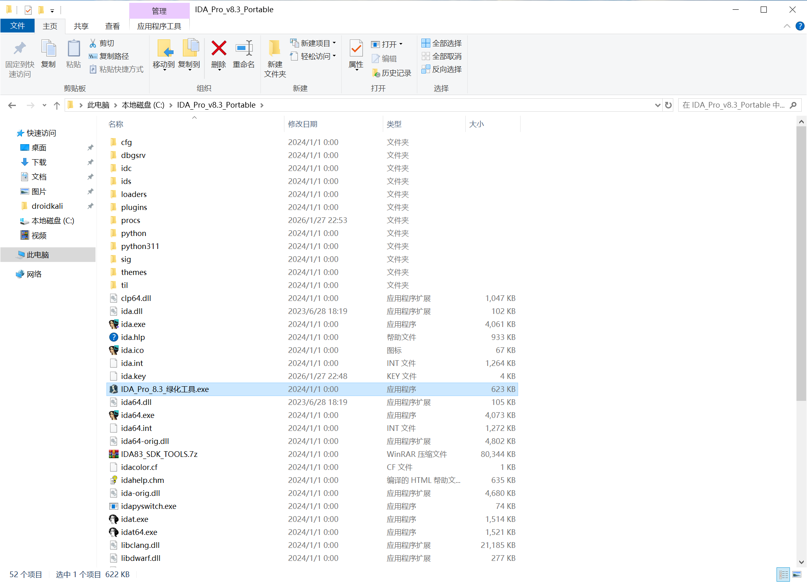
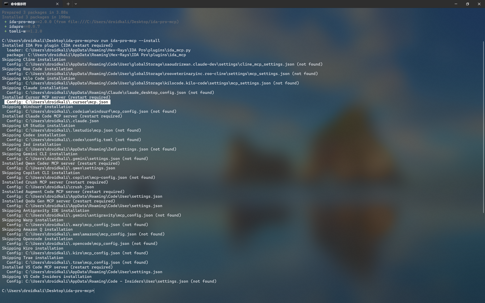
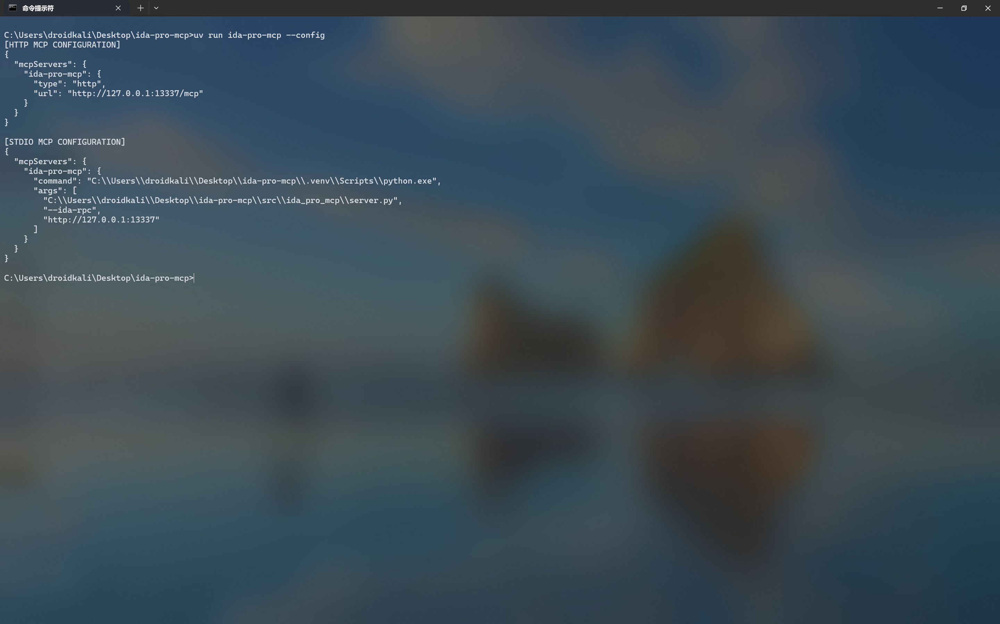
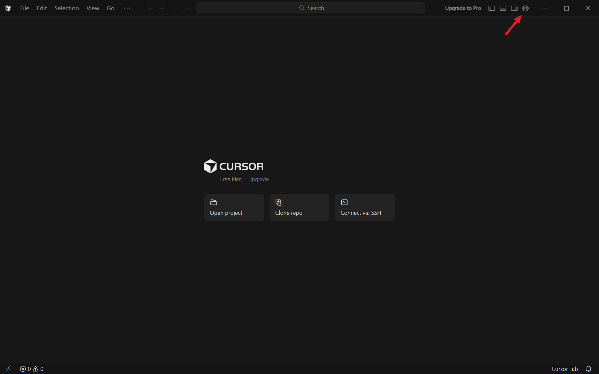
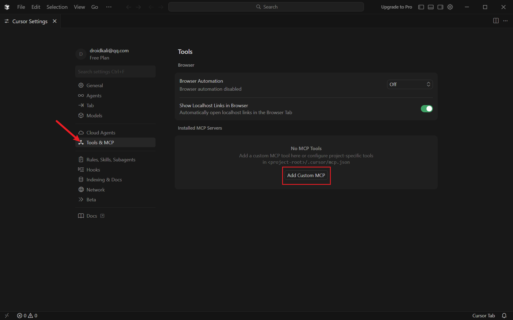
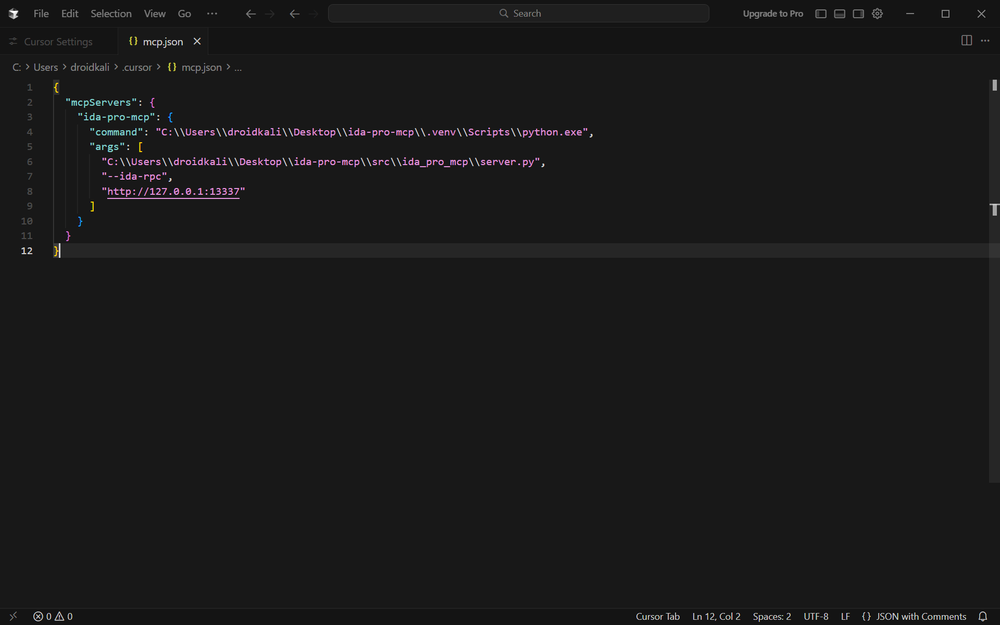
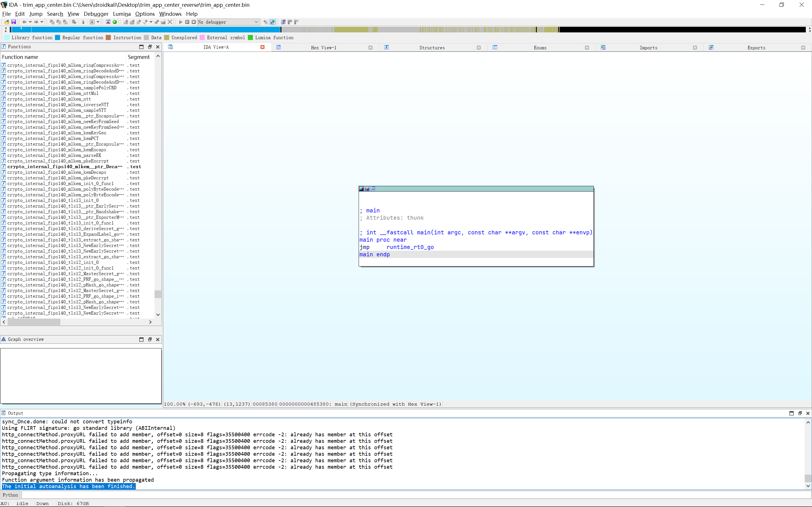
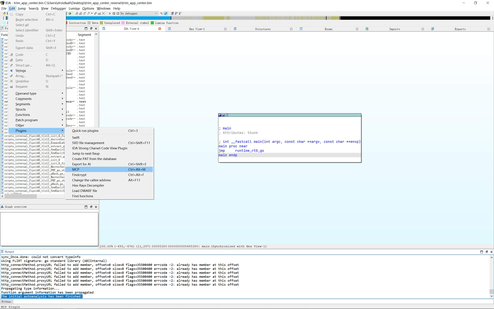
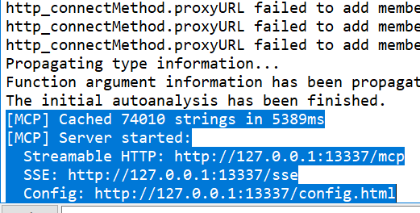
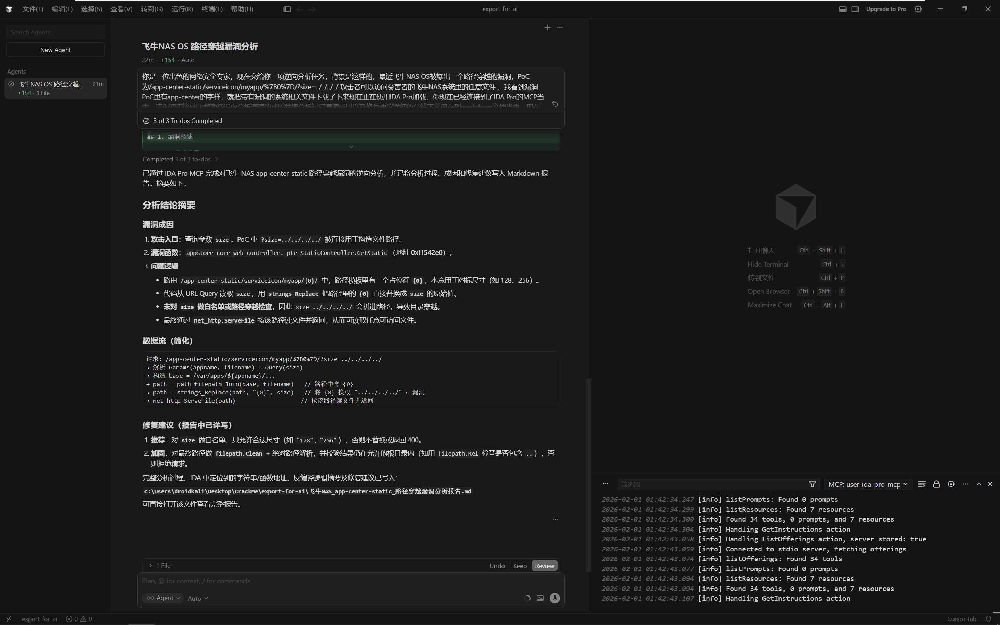

# IDA Pro MCP 部署 & 分析飞牛OS漏洞

<!--more-->
## 1.前言
最近看到 **[飞牛NAS OS](https://www.fnnas.com)** 被曝存在[路径穿越漏洞](https://www.landiannews.com/archives/111674.html)，结合当下 **AI MCP Agent** 热度爆火，于是就想记录一下使用MCP来逆向分析溯源的能力。

## 2.逆向环境介绍
| 工具 | 名称 | 版本 |
| --- | --- | --- |
| **系统** | **Windows 10 LTSC 2021 x64** | **21h2** |
| **逆向分析工具** | **IDA Pro** | **8.3** |
| **MCP Agent** | **IDA Pro MCP** | **2.0.0** |
| **AI IDE** | **Cursor** | **2.4.27** |
| **Python版本管理工具** | **uv** | **0.9.28** |

## 3.环境准备
#### 3.1 下载部署IDA Pro
https://down.52pojie.cn/Tools/Disassemblers/IDA_Pro_v8.3_Portable.zip

下载后将其解压到任意非中文目录

然后运行 **IDA_Pro_8.3_绿化工具.exe**


#### 3.2 安装UV
```powershell
powershell -ExecutionPolicy ByPass -c "irm https://astral.sh/uv/install.ps1 | iex"
```

#### 3.3 安装Cursor
https://cursor.com/cn/download

安装过程略过。
#### 3.4 克隆 IDA Pro MCP 源代码
```bash
git clone https://github.com/mrexodia/ida-pro-mcp.git
cd ida-pro-mcp
```

#### 3.5 设置环境变量加速Python和pip安装
```bash
set UV_DEFAULT_INDEX=https://mirrors.cernet.edu.cn/pypi/web/simple
set UV_PYTHON_INSTALL_MIRROR=https://mirror.nju.edu.cn/github-release/astral-sh/python-build-standalone/
```

#### 3.6 同步运行环境
```bash
uv sync
```

#### 3.7 运行 IDA Pro MCP 安装脚本
```bash
uv run ida-pro-mcp --install
```
运行这条命令会自动将IDA Pro MCP插件复制到 **C:\Users\\<你的用户名>\AppData\Roaming\Hex-Rays\IDA Pro\plugins** 目录当中，同时也会自动检测系统中已安装的AI IDE并自动将MCP json配置文件复制到对应的AI IDE配置文件夹当中。


如果上面的命令没有成功复制MCP json配置文件到你的AI IDE配置文件夹，你也可以手动运行下面的命令生成MCP json然后手动复制粘贴到你的AI IDE当中。

```bash
uv run ida-pro-mcp --config
```


#### 3.8 配置Cursor MCP设置
如果上一步的命令已经成功的将MCP json文件复制到对应的目录下则不需要进行这一步操作，否则请按照以下的步骤进行：

首先进入到 ida-pro-mcp 的源代码路径
```bash
cd ida-pro-mcp
```
然后运行：
```bash
uv run ida-pro-mcp --config
```
复制 **[STDIO MCP CONFIGURATION]** 下面的内容
我这里的json内容是
```json
{
  "mcpServers": {
    "ida-pro-mcp": {
      "command": "C:\\Users\\droidkali\\Desktop\\ida-pro-mcp\\.venv\\Scripts\\python.exe",
      "args": [
        "C:\\Users\\droidkali\\Desktop\\ida-pro-mcp\\src\\ida_pro_mcp\\server.py",
        "--ida-rpc",
        "http://127.0.0.1:13337"
      ]
    }
  }
}
```
具体以你自己的实际情况为准！
接着我们打开 Cursor 点击右上角的设置图标

找到 **Tools & MCP** 在右边 **Installed MCP Servers** 下点击 **Add Custom MCP**

接着将刚才复制的 MCP json内容粘贴进去并保存

这样我们就完成了 **Cursor** 的设置.

## 4.开始逆向分析
首先我们按照 [飞牛OS任意文件/目录读取漏洞复现，并学习尝试深入系统文件分析信息处理流程](https://mp.weixin.qq.com/s/er53Zd0xWiuazTBpIITS8Q) 这篇文章作者的思路, 从带有漏洞的飞牛OS里提取相对应的二进制程序

具体路径为 **/usr/trim/bin/trim_app_center**

我这里提取的飞牛OS系统版本为 **v1.0.0**

**trim_app_center** 文件的校验码为

SHA256：
```
79dab1f0bdcf047c3d4be6115076c527e3f96888012eb6978f0e776786c17ce0 trim_app_center
```
我们打开 **IDA Pro** 来加载这个程序

等待 **IDA Pro** 加载完成, 接着我们点击左上角的 **Edit --> Plugins --> MCP  Ctrl+Alt+M**

等待左下角出现以下输出说明 **MCP** 服务已经成功运行了


接着我们打开 **Cursor**
按 **Ctrl + Shift + L** 打开对话窗口，然后输入以下提示词
```
你是一位出色的网络安全专家，现在交给你一项逆向分析任务
背景是这样的，最近飞牛NAS OS被爆出一个路径穿越的漏洞，PoC为: /app-center-static/serviceicon/myapp/%7B0%7D/?size=../../../../ 
攻击者可以访问受害者的飞牛NAS系统里的任意文件
我看到漏洞PoC里有app-center的字样，就把带有漏洞的系统相关文件下载了下来现在正在使用IDA Pro加载
你现在已经连接到了IDA Pro的MCP当中
请你调用该MCP帮助我逆向分析漏洞的成因并把分析过程漏洞成因以及修复建议详细的总结下来保存到markdown文档当中.
现在请开始分析
```
等待 **Cursor** 自动连接**IDA Pro MCP** 并进行分析

以下是 **Cursor** 逆向分析的总结报告：

***
# 飞牛 NAS OS app-center-static 路径穿越漏洞逆向分析报告

## 1. 漏洞概述

### 1.1 基本信息

| 项目 | 说明 |
|------|------|
| **漏洞类型** | 路径穿越 (Path Traversal) |
| **受影响组件** | 飞牛 NAS OS - app-center 静态资源服务 |
| **PoC 路径** | `/app-center-static/serviceicon/myapp/%7B0%7D/?size=../../../../` |
| **危害** | 攻击者可读取受害 NAS 系统上的任意文件 |
| **分析环境** | IDA Pro + user-ida-pro-mcp，Go 二进制逆向 |

### 1.2 PoC 说明

- **URL 解码**：`%7B0%7D` → `{0}`，即路径中含占位符 `{0}`。
- **攻击点**：查询参数 `size=../../../../` 被拼入最终文件路径，导致跳出应用目录，访问任意路径。
- **路由特征**：`/app-center-static/serviceicon/<appname>/<filename>/`，并带有查询参数 `size`。

---

## 2. 分析过程

### 2.1 字符串与路由定位

通过 IDA Pro MCP 在二进制中搜索与漏洞相关的字符串，得到如下地址：

| 字符串 | 地址 | 说明 |
|--------|------|------|
| `app-center` | 0x1592454 | 静态资源路由前缀 |
| `serviceicon` | 0x1581a45 | 服务图标子路径 |
| `size` | 0x21162ae | 查询参数名（攻击入口） |
| `../` | 0x2119801 | 路径穿越序列 |
| `..\` | 0x2170aec | Windows 风格穿越序列 |

结合函数名可知，处理该路由的控制器为 **appstore (app-center) 静态资源模块**。

### 2.2 关键函数识别

在 IDA 中列出与 `static`、`service`、`app` 相关的函数，定位到：

| 函数名 | 地址 | 作用 |
|--------|------|------|
| `appstore_core_web_controller._ptr_StaticController.GetStatic` | **0x11542e0** | **漏洞核心：处理 /app-center-static 的静态资源请求** |
| `appstore_core_web_controller._ptr_StaticController.GetTmpStatic` | 0x1154c20 | 临时静态资源 |
| `appstore_core_web_controller._ptr_StaticController.GetSidebarStatic` | 0x11550a0 | 侧边栏静态资源 |
| `appstore_core_util._ptr_StaticUtil.CreateSidebarIconPath` | 0x981200 | 侧边栏图标路径构造 |
| `github.com_gin_gonic_gin._ptr_RouterGroup.staticFileHandler` | 0x11451c0 | Gin 静态文件处理 |
| `path_filepath.join` | 0x4f0e80 | 路径拼接 |
| `net_http.ServeFile` | 0x6df020 | 最终按路径提供文件 |

漏洞分析集中在 **GetStatic**。

### 2.3 GetStatic 反编译逻辑摘要

对 `GetStatic` (0x11542e0) 进行反编译后，可还原出如下逻辑（与路径穿越直接相关的部分）：

1. **从 Gin Context 解析参数**
   - **Route Params**：按 Key 长度区分
     - 长度 7 → 对应 **appname**（应用名）
     - 长度 8 → 对应 **filename**（文件名/路径片段）
     - 长度 4 → 对应 **type**（资源类型）
   - **Query**：通过 `net_url__ptr_URL_Query` 取 URL 查询，再通过 `runtime_mapaccess1_faststr` 按 key 取 **size** 的值。

2. **按 type 分支**
   - 根据 type 与常量字符串比较，进入不同分支（如 icon、poster、wizard、license、**serviceicon** 等）。
   - 当 type 为 **“serviceicon”**（长度 11）时，进入存在漏洞的分支。

3. **serviceicon 分支中的路径构造（漏洞点）**
   - 使用 **appstore_core_util_Replace** 将模板中的 `${appname}` 替换为路由中的 appname，得到基础路径（形式类似 `/var/apps/${appname}/...`，具体模板在反编译中为多字符串混合，需结合字符串表确认）。
   - 使用 **path_filepath_Join** 将「基础路径」与「filename」拼接，得到中间路径（含占位符 `{0}`，用于后续填入图标尺寸）。
   - 使用 **strings_Replace** 将路径中的占位符 **`{0}`** 替换为 **URL 查询参数 `size` 的原始值**，得到最终路径。
   - 对 `size` 仅做了简单长度/内容判断（如长度 3 且为 "256"/"128" 时调用 `Faccessat`），**未对 `size` 做路径穿越过滤或白名单校验**。
   - 最后调用 **net_http_ServeFile**，将上述**最终路径**作为文件路径，向客户端返回文件内容。

因此，当请求中 **size=../../../../** 时：

- 占位符 `{0}` 被替换为 `../../../../`；
- 最终路径变为「原基础路径 + 路径穿越序列」，从而跳出应用目录；
- **ServeFile** 根据该路径读取并返回任意可读文件，形成路径穿越读文件。

### 2.4 数据流小结

```
请求: GET /app-center-static/serviceicon/myapp/%7B0%7D/?size=../../../../

→ GetStatic 解析:
   - Params: appname, filename (含 {0}), type = "serviceicon"
   - Query: size = "../../../../"

→ 路径构造:
   base = Replace("/var/apps/${appname}/...", appname)
   path1 = path_filepath_Join(base, filename)   // 路径中仍含 {0}
   path2 = strings_Replace(path1, "{0}", size)  // 将 {0} 换为 "../../../../" ← 漏洞

→ net_http_ServeFile(response, request, path2)
   → 访问 path2 对应路径，返回任意文件内容
```

---

## 3. 漏洞成因总结

| 维度 | 说明 |
|------|------|
| **直接原因** | 将 URL 查询参数 `size` 未经校验地替换到文件路径的占位符 `{0}` 中，并交给 `ServeFile` 使用。 |
| **设计问题** | `size` 本意应为图标尺寸（如 "128"/"256"），却直接参与路径拼接，且未做白名单或规范化。 |
| **缺失防护** | 未对 `size` 做：白名单、`../`/`..\` 过滤、或基于 `filepath.Clean` + 根路径校验的规范化与边界检查。 |
| **利用条件** | 攻击者只需构造合法路由（如 serviceicon + appname + 含 `{0}` 的 filename），并在查询中传入 `size=../../../../` 等序列即可。 |

---

## 4. 修复建议

### 4.1 推荐方案：对 size 做白名单（最小改动）

- **做法**：仅允许 `size` 为预定集合（如 `"128"`, `"256"` 等合法图标尺寸）；否则不替换 `{0}` 或直接返回 400。
- **示例逻辑**（伪代码）：
  - 若 `size` 不在 `map[string]bool{"128":true, "256":true}` 等白名单中，则：
    - 不使用 `size` 参与路径拼接，或
    - 返回 `400 Bad Request`，并记录日志。
- **优点**：改动小、易审计、能彻底杜绝将 `size` 用作路径穿越。

### 4.2 路径规范化与根路径校验（加固）

- **做法**：
  1. 使用 `filepath.Clean` 对「拼接并替换后的路径」做规范化；
  2. 使用 `filepath.Abs` 得到绝对路径；
  3. 使用 `filepath.Rel(baseDir, resolvedPath)` 或 `strings.HasPrefix` 判断解析后的路径是否仍在 `baseDir` 之下；
  4. 若包含 `..` 或不在 baseDir 内，则拒绝请求并返回 403。
- **注意**：在 Go 中应使用 `filepath.Rel` 检查“结果路径是否仍在根目录内”，避免符号链接等导致的绕过。

### 4.3 通用安全规范

- 所有参与文件路径拼接的输入（Params、Query、Header）均应：
  - 要么白名单校验（如 size 仅允许数字字符串且限定集合）；
  - 要么在拼接后做规范化 + 根路径校验，再交给 `ServeFile`。
- 避免将用户可控字符串直接替换到路径模板中；若必须替换，只允许白名单内的值。
- 对静态资源接口做访问控制与审计日志，便于发现异常访问。

---

## 5. 附录：IDA 分析关键信息

- **漏洞函数**：`appstore_core_web_controller._ptr_StaticController.GetStatic` @ **0x11542e0**
- **关键调用链**：  
  `GetStatic` → `appstore_core_util_Replace` → `path_filepath_Join` → `strings_Replace(..., size)` → `net_http_ServeFile`
- **二进制特征**：Go 编译，包含 `git.teiron_inc.cn`、`appstore_core`、`github.com/gin-gonic/gin` 等包路径，与飞牛 NAS app-center 静态服务一致。

---

*报告基于 IDA Pro 与 user-ida-pro-mcp 对飞牛 NAS app-center 相关二进制的逆向分析整理。*
***

## 6.参考链接
[国产飞牛系统fnOS疑似出现重大安全漏洞 大量用户数据遭到公开访问](https://www.landiannews.com/archives/111674.html)

[飞牛OS任意文件/目录读取漏洞复现，并学习尝试深入系统文件分析信息处理流程](https://mp.weixin.qq.com/s/er53Zd0xWiuazTBpIITS8Q)

[IDA Pro MCP](https://github.com/mrexodia/ida-pro-mcp.git)

